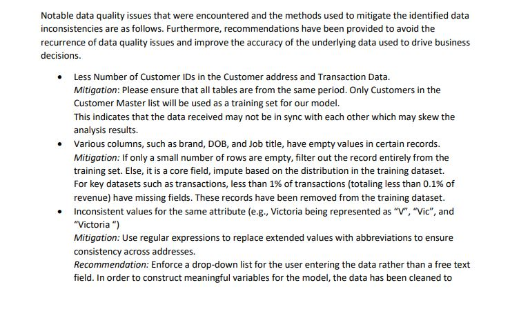
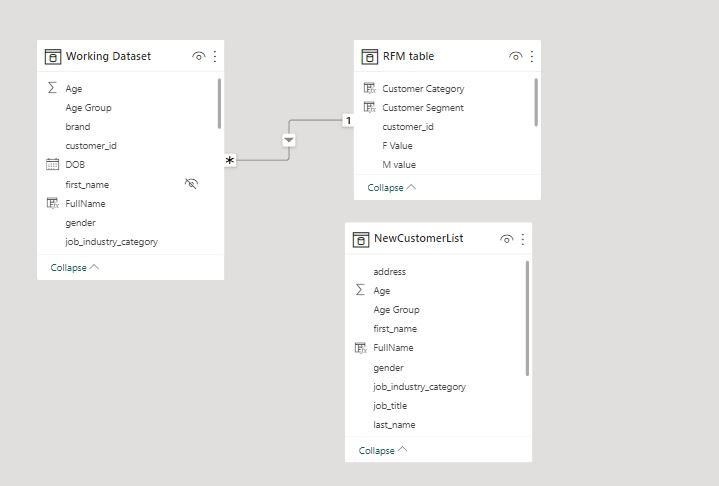
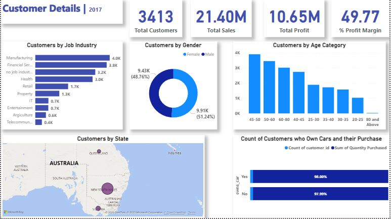
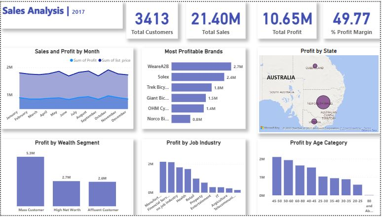
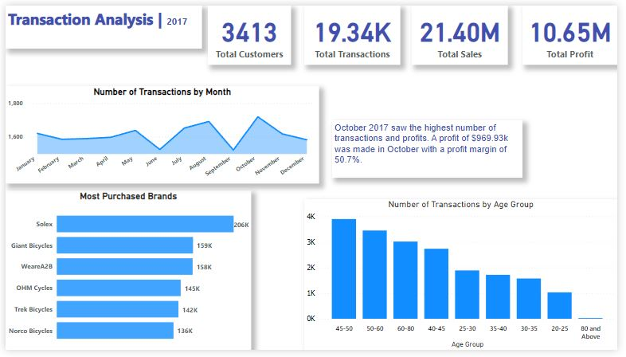
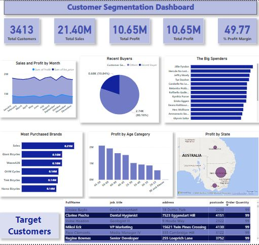

# Sprocket Central Pty Ltd: A Customer Segmentation Analysis

## Introduction
Sprocket Central Pty Ltd is a medium size bikes and accessories organization that needs help with its customer and transactions data. The organization has a large dataset on its customers but their team is unsure how to effectively analyze it to help optimize its marketing strategy. 
This project uses Power BI to analyze the data and derive insights for the team at Sprocket. 

**_Disclaimer_** : This is an imaginary company that was made up for the purpose of the KPMG Virtual Internship.

## Problem Statement
1. The dataset provided by Sprocket needs Data Quality Assessment and recommendations on ways to clean the data. 
2. Develop reports and a dashboard for the client. It should answer the following business questions;
   - What are the trends in the underlying data?
   - Which customer segment has the highest customer value?
   - What do you propose should be Sprocket Central Pty Ltd ’s marketing and growth strategy?
   - Specify who Sprocket Central Pty Ltd’s marketing team should be targeting out of the new 1000 customer list as well as the broader market segment to reach out to.
   
## Skills/ Concepts Demonstrated
The following Power BI features were incorporated;
- DAX
- Quick measures
- Calculated Columns
- Modelling.

## Data Quality Assesment
The snippet below is a part of the data quality assessment report that was made foor the client. Click [here](https://github.com/Alberda1612/KPMG-Internship/blob/main/Data%20Quality%20Assessment%20Report.pdf) to view the full report. 

## Modelling
Three datasets were provided; Customer Demographic, Customer Address and Transaction Dataset. Unnecessary data was removed and the three datasets were joined as one, using Customer Id as the Primary key to join all three datasets and renamed, Working dataset. 
A new table was created for the RFM analysis called the RFM table. A many to one relationship was created from the Customer data table to the RFM table using the Customer ID. Below is the final model that was used for the analysis. The new customer list was loaded as a seperate table since it had no relation with the Working dataset.

## Visualization
The report comprises 4 pages;
1. Customer Details

From the report, we notice that Sprocket has 3413 customers with majority of the customers based in New South Wales, Australia. There is almost the same number of males to females with females being about 3% higher than male customers. 

2. Sales Analysis 

From the Sales report, we can see that a total of $21.4 million dollars sales was made in 2017. Out of this, a profit of $10.65 million profit was made. This is about 50% profit margin. The highest sales was made in October, 2017 after which the sales declined until December and beyond. New South Wales being the city with our most customers, also gave in the highest sales. 

3. Transactions

A total of 19.34k transactions was made in 2017 with October recording the highest number of transactions. Out of the $10.65 million profit made, October alone gave a profit of $969.93k profit. We also noticed that the Solex and Giant Bicycles were the most purchased brands. Customers aged between 40 and 60 tend to purchase more. 

4. Segmentation Dashboard

Click on the link [here](https://app.powerbi.com/groups/me/dashboards/640bceec-b96c-4e13-98cf-ad2d220740ee) to interact with the dashboard.

## Recommendations 
1. On the dashboard, we see a list of specific new customers to target to bring in more sales to the company. 
2. More marketing strategies should be targeted for the New South Wales customers and the city in general. 
3. People aged between 40-60 years should be targeted as well.
4. There was an almost equal purchase for both males and females hence both gender should be targeted equally.
5. People living at the outskirts of town should be targeted as such people are more likely to need Bike services.
6. The company should make available more products and new products from Solex Brand as customers purchase the brand more, hence are likely to trust other Bike accessories from the brand.
